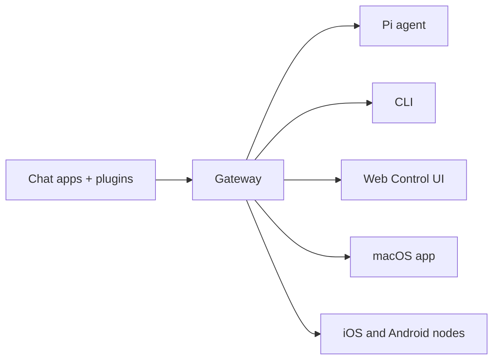

# OpenSoul 

<p align="center">
  
</p>

> _"EXFOLIATE! EXFOLIATE!"_ — A space lobster, probably

<p align="center">
  <strong>Your AI Soul Companion — Chat, Collaborate, Create.</strong><br />
  Self-hosted AI agent across WhatsApp, Telegram, Discord, Slack, and 30+ more channels.
  Your personal AI companion for life and work.
</p>

### [Get Started](/start/getting-started)
Install OpenSoul and bring up the Gateway in minutes.

### [Run the Wizard](/start/wizard)
Guided setup with `opensoul onboard` and pairing flows.

### [Open the Control UI](/web/control-ui)
Launch the browser dashboard for chat, config, and sessions.

## What is OpenSoul?

OpenSoul is a **self-hosted AI agent gateway** that connects your favorite chat apps — WhatsApp, Telegram, Discord, Slack, iMessage, and 30+ more — to AI agents like Pi. You run a single Gateway process on your own machine (or a server), and it becomes the bridge between your messaging apps and an always-available AI companion.

**Who is it for?** Anyone who wants a personal AI companion they can message from anywhere — for emotional support, productivity, or coding — without giving up control of their data or relying on a hosted service.

**What makes it different?**

- **Self-hosted**: runs on your hardware, your rules
- **Multi-channel**: one Gateway serves WhatsApp, Telegram, Discord, and more simultaneously
- **Agent-native**: built for coding agents with tool use, sessions, memory, and multi-agent routing
- **Open source**: MIT licensed, community-driven

**What do you need?** Node 22+, an API key (Anthropic recommended), and 5 minutes.

## How it works



The Gateway is the single source of truth for sessions, routing, and channel connections.

## Key capabilities

### Multi-channel gateway
WhatsApp, Telegram, Discord, and iMessage with a single Gateway process.

### Plugin channels
Add Mattermost and more with extension packages.

### Multi-agent routing
Isolated sessions per agent, workspace, or sender.

### Media support
Send and receive images, audio, and documents.

### Web Control UI
Browser dashboard for chat, config, sessions, and nodes.

### Mobile nodes
Pair iOS and Android nodes with Canvas support.

## Quick start

### Install OpenSoul
```bash
npm install -g opensoul@latest
```

### Onboard and install the service
```bash
opensoul onboard --install-daemon
```

### Pair WhatsApp and start the Gateway
```bash
opensoul channels login
opensoul gateway --port 18789
```

Need the full install and dev setup? See [Quick start](/start/quickstart).

## Dashboard

Open the browser Control UI after the Gateway starts.

- Local default: [http://127.0.0.1:18789/](http://127.0.0.1:18789/)
- Remote access: [Web surfaces](/web/index) and [Tailscale](/gateway/tailscale)

## Configuration (optional)

Config lives at `~/.opensoul/opensoul.json`.

- If you **do nothing**, OpenSoul uses the bundled Pi binary in RPC mode with per-sender sessions.
- If you want to lock it down, start with `channels.whatsapp.allowFrom` and (for groups) mention rules.

Example:

```json5
{
  channels: {
    whatsapp: {
      allowFrom: ["+15555550123"],
      groups: { "*": { requireMention: true } },
    },
  },
  messages: { groupChat: { mentionPatterns: ["@opensoul"] } },
}
```

## Start here

### [Docs hubs](/start/hubs)
All docs and guides, organized by use case.

### [Configuration](/gateway/configuration)
Core Gateway settings, tokens, and provider config.

### [Remote access](/gateway/remote)
SSH and tailnet access patterns.

### [Channels](/channels/telegram)
Channel-specific setup for WhatsApp, Telegram, Discord, and more.

### [Nodes](/nodes/index)
iOS and Android nodes with pairing and Canvas.

### [Help](/help/index)
Common fixes and troubleshooting entry point.

## Learn more

### [Full feature list](/concepts/features)
Complete channel, routing, and media capabilities.

### [Multi-agent routing](/concepts/multi-agent)
Workspace isolation and per-agent sessions.

### [Security](/gateway/security/index)
Tokens, allowlists, and safety controls.

### [Troubleshooting](/gateway/troubleshooting)
Gateway diagnostics and common errors.

### [About and credits](/reference/credits)
Project origins, contributors, and license.
